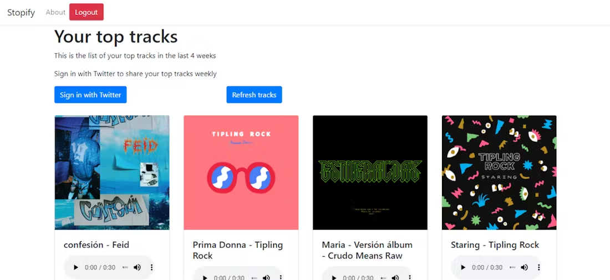

# Stopify Bot
Bot to tweet weekly the tracks you have listened the most in Spotify.
Functional app: https://stopifybot.herokuapp.com (app not live anymore)

## How it used to look

Home after signing up with Spotify:

You had the option to link your Twitter account and every week you would get a tweet with the top 1 track you listened the most in Spotify during the week (I lost the screenshot how it looked like 😭).

# Stack
* Flask
* Bootstrap
* Twitter API (https://github.com/bear/python-twitter)
* Spotify API (https://github.com/plamere/spotipy)
* Heroku
